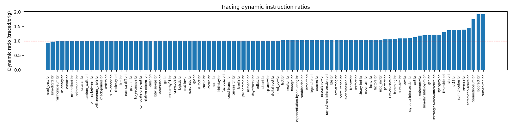

# Lesson 12 – Trace-Based Speculation

This lesson uses a modified tracing-enabled `brili` (supports `--trace-out`) to record a linear trace prefix of `main` on a training input, then injects that trace as a speculative fast path. If guard predicates succeed we `commit` and jump past the traced prefix; otherwise we abort to original code.

## Components

- `test_tracing.py` – Harness (patterned after lesson 8) that discovers benchmarks, extracts `#ARGS:`, runs original, trains trace (`brili --trace-out=...`), injects with `trace_inject.py`, reruns traced version, collects static & dynamic instruction counts, writes JSON, optional plot.
- `trace_inject.py` – Reads `__trace_main` + `__trace_meta_main` (providing `__trace_stop_index`), wraps trace with `speculate` / `commit`, inserts abort label `__trace_abort`, jumps to a continuation label at the recorded stop index, drops helper functions.
- `benchmarks/` – Suites (`core`, `float`, `long`, `mixed`, etc.) reused from prior lessons.
- `tmp/` – Per-benchmark artifacts: `*.base.json`, `*.trace.json`, `*.traced.json`, `*.traced.bril`, `*.train.log`.

## Tracing Interpreter

You must use the tracing-enabled `brili` from the `trace` branch of the fork:

Repository: https://github.com/syphonarch/bril (branch `trace`)

Install (Deno):
```bash
git clone https://github.com/syphonarch/bril
cd bril
git checkout trace
deno install -g \
	--allow-read \
	--allow-write \
	brili.ts
```
This provides a `brili` binary (in your Deno bin directory) supporting `--trace-out`.

## Trace Rules (from modified `brili`)

- Branch in trace: `br cond L1 L2` becomes `guard cond __trace_abort` (no branch bodies copied).
- Recording stops at: `print`, `call`, memory ops (`alloc`, `free`, `store`, `load`, `ptradd`), `speculate`, `commit`, any backedge, or length limit (default 200).
- Empty trace still produces file with `__trace_main` + meta (`__trace_stop_index` default 0).

## Usage

```bash
python test_tracing.py                       # all suites
python test_tracing.py benchmarks/core/graycode.bril
python test_tracing.py --plot --png trace_dyn.png
```

Sample aggregate output:

```
Target programs: 92
100%|█████████████████| 92/92 [01:02<00:00,  1.48it/s]
Successful optimizations: 90/92
Static Instr Ratio (GM traced/orig): 1.598x
Dynamic Instr Ratio (GM traced/orig): 1.066x
Wrote results to lesson12_results.json
```

### Dynamic Ratio Plot



The bar chart (generated with `--plot --png trace_dyn.png`) visualizes per-program dynamic instruction ratios; bars above 1.0 indicate added speculative overhead or frequent aborts, below 1.0 indicate net savings from the fast path.

## Results JSON Fields

- `verdict` (`Good!` or BAD categories)  | `static_orig` / `static_traced`  | `dyn_orig` / `dyn_traced` | outputs for strict comparison.

## Interpreting Ratios

- Static ratio > 1 due to duplicated prefix + guard overhead.
- Dynamic ratio may be > 1 (abort overhead) or < 1 (successful fast path).

## Notes & Limitations

- Conservative: calls & memory ops terminate trace (no rollback of side effects yet).
- Single training input; generalization not evaluated.

## Acknowledgment
Tracing harness & README authored with ChatGPT assistance.
