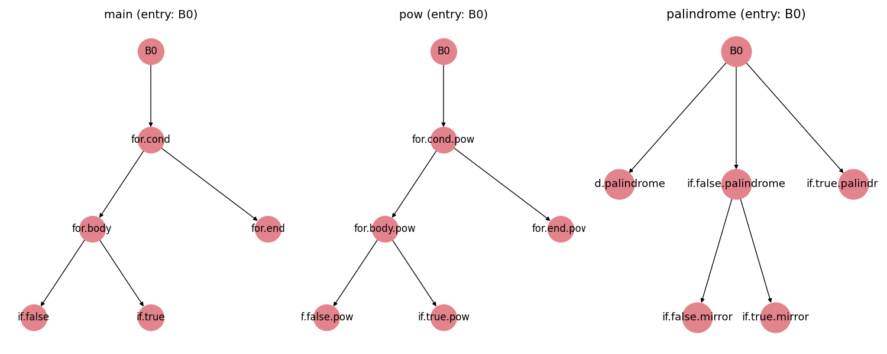

# Dominance Analysis Tool

Analyze Bril programs to compute dominators, immediate dominators, dominance trees, and dominance frontiers for each function’s CFG.

## Usage

```bash
bril2json < program.bril | python3 dominance.py [--vis] [--naive_check]
```

* `--vis`: show dominance trees.
* `--naive_check`: cross-check with a slow naive algorithm.

## Output

JSON results per function. With `--vis`, dominance trees are plotted.

## Install

```bash
pip install matplotlib networkx pygraphviz
```

PyGraphviz may require additional system dependencies. Please check the official documentation for platform-specific installation instructions.


## Example Visualization


This is an example of dominance trees for [`palindrome.bril`](https://github.com/sampsyo/bril/blob/main/benchmarks/core/palindrome.bril)

## Generative AI

Visualization code (layout and scaling) was assisted by ChatGPT.
