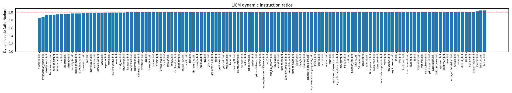
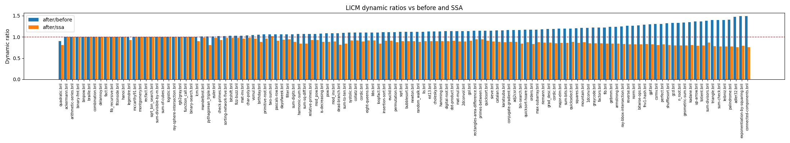

# Lesson 8 – Loop-Invariant Code Motion (LICM)

Implements and evaluates a LICM optimization for Bril, with an optional SSA mode and a testing harness that verifies correctness, measures instruction counts, and generates plots.

## Files

- `licm.py` — LICM pass over Bril functions. Optional SSA wrapper: convert to SSA, run LICM, convert back.
- `test_licm.py` — Batch harness to run LICM on benchmarks, check correctness with `brili`, compute static/dynamic instruction ratios, write JSON, and plot.
- `benchmarks/` — Benchmark suites used for evaluation (`core`, `float`, `long`, `mem`, `mixed`).
- `tmp/` — Intermediate/transformed programs and scratch outputs for debugging.

## Usage

- Single file: `python test_licm.py benchmarks/core/graycode.bril`
- All suites: `python test_licm.py benchmarks/core benchmarks/float benchmarks/long benchmarks/mem benchmarks/mixed --plot --png licm_all.png`
- With SSA baseline comparison: `python test_licm.py benchmarks/core benchmarks/float benchmarks/long benchmarks/mem benchmarks/mixed --ssa --plot --png ssa_licm_all.png --out results_ssa_licm.json`

Artifacts:
- Results JSON: `results_licm.json` (or custom via `--out`).
- Plots: `licm_all.png` and `ssa_licm_all.png` when `--plot` and `--png` are provided.

Requirements:
- Bril toolchain: `bril2json`, `bril2txt`, and `brili -p`.
- Python packages: `tqdm`, `matplotlib` (for plotting).

## Results

All numbers below are geometric means (GM) of ratios across programs.

- Unless noted, ratios are After/Before. So < 1.0 means fewer instructions after LICM (better); > 1.0 means more (worse).
- When `--ssa` is used, we also report After/SSA. So < 1.0 means the LICM-transformed program has fewer instructions than the raw SSA baseline.
	Dynamic ratios use `brili -p` totals.

Full suites without SSA wrapping:

- Target programs: 122
- Successful optimizations: 122/122
- Static Instr Ratio (GM): 1.017x
- Dynamic Instr Ratio (GM): 0.992x
- Plot saved: `licm_all.png`
- Results saved: `results_licm.json`

Full suites with SSA wrapping and SSA baseline comparison:

- Target programs: 122
- Successful optimizations: 122/122
- Static Instr Ratio (GM): 1.149x
- Dynamic Instr Ratio (GM): 1.130x
- Static vs SSA (GM): 0.965x
- Dynamic vs SSA (GM): 0.894x
- Plot saved: `ssa_licm_all.png`
- Results saved: `results_ssa_licm.json`

Interpretation:
- LICM consistently preserves behavior (122/122 “Good!”).
- Non-SSA runs show a small static overhead (ratio > 1) and near-break-even dynamics (ratio ~ 1), with slight dynamic reductions on average.
- SSA wrapping increases hoisting opportunities; compared to the raw SSA baseline, the LICM-transformed program is smaller and faster on average (After/SSA < 1.0).
 - From the SSA plot, programs that suffer larger dynamic-instruction increases in the SSA baseline tend to benefit more from LICM (lower After/SSA), indicating LICM recovers some SSA-introduced redundancy.

## Harness details

- Correctness: Runs original and optimized with the same `#ARGS:` and compares outputs.
- Verdicts: Reports detailed BAD categories (orig/opt timeout or fail, mismatch) for quick triage; all benchmarks report Good in the final runs.
- Metrics: Static counts are instruction totals; dynamic counts come from `brili -p` stderr (`total_dyn_inst`). Reports geometric means across suites and writes per-program stats to JSON.
- Plots: When `--ssa` is used, the plot shows grouped bars for After/Before and After/SSA; otherwise a single series for After/Before.

## Debugging

- See `lesson8/tmp/` for transformed `.bril` programs (e.g., `foo.bril.licm`) to inspect hoisted code and preheaders.
- If a program fails, the JSON will record the verdict and any stderr; use these to reproduce locally.

## Notes

- Benchmarks and test style mirror prior lessons (e.g., SSA harness in lesson 6) for comparability.
- The implementation favors correctness and simplicity over aggressive speculation.

## Generative AI

- ChatGPT was used to help port the previous lesson's testing harness to this LICM lesson, adapting it for the new optimization while maintaining similar structure and functionality.
